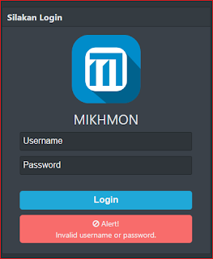
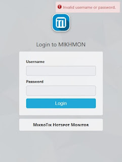

# Cara Mengubah Sandi Mikhmon yang Lupa

Jika Anda lupa password Mikhmon dan ingin merubahnya, Anda bisa mengikuti dua cara yang berbeda<!-- truncate -->, yaitu:



- mikhmon v3



- mikhmon v4

## Cara Pertama: Mengubah Password Secara Langsung pada `config.php`

1. Akses file `config.php` yang terletak pada folder `./include/`.
   ```bash
   nano ./include/config.php
   ```

2. Pada bagian berikut:
   ```php
    $data['mikhmon'] = array ('1'=>'mikhmon<|<mikhmon','mikhmon>|>e5mTppiXhZZjag==');
   ```

   Anda dapat mengganti password yang terenkripsi tersebut dengan password default. Misalnya, Anda ingin menggantinya menjadi:
   ```php
    $data['mikhmon'] = array ('1'=>'mikhmon<|<mikhmon','mikhmon>|>aWNlbA==');
   ```

   **Catatan**: `mikhmon>|>aWNlbA==` adalah password terenkripsi yang sudah diganti dengan password default "1234" yang terenkripsi. Anda juga dapat mengganti bagian ini dengan password yang baru sesuai kebutuhan.

3. Jika sudah selesai, simpan perubahan dan coba login menggunakan username dan password default:
   - Username: `mikhmon` -> atau username kalian
   - Password: `1234`

## Cara Kedua: Menggunakan Tools Enkripsi dan Dekripsi yang Kami Buat

Kami juga menyediakan tools enkripsi dan dekripsi yang dapat Anda gunakan untuk mengganti password atau mengetahui password yang lupa. Berikut adalah cara penggunaannya:

### 1. Unduh Source Code
   Anda bisa mengunduh source code dari GitHub di [link ini](https://github.com/ryanachmad12/mikhmon_password_lupa.git).

### 2. Penggunaan Tools Enkripsi dan Dekripsi

Setelah mengunduh dan menyiapkan tools jangan lupa copy bagian password (e,g `aWNlbA==`) pada bagian `/path/kamu/include/config.php`, jalankan `main.php` menggunakan PHP di terminal Anda:
```bash
root@opslinuxsec /v/w/d/h/lib [SIGINT]# php main.php
```

Pada menu yang muncul, Anda bisa memilih opsi berikut:
- Pilih **1** untuk enkripsi password.
- Pilih **2** untuk dekripsi password yang sudah terenkripsi.
- Pilih **3** untuk keluar.

#### Contoh Penggunaan untuk Enkripsi:

```bash
===== Menu =====
1. Enkripsi
2. Dekripsi
3. Keluar
Pilih operasi (1/2/3): 1
Masukkan sandi plaintext yang akan dienkripsi: ChangeMe12
Hasil Enkripsi: e5mTppiXhZZjag==
===== Menu =====
1. Enkripsi
2. Dekripsi
3. Keluar
Pilih operasi (1/2/3):
```

Di sini, Anda akan diminta untuk memasukkan password plaintext (misalnya: `ChangeMe12`), dan tools ini akan mengembalikan hasil enkripsi berupa string terenkripsi, misalnya `e5mTppiXhZZjag==`.

#### Contoh Penggunaan untuk Dekripsi:

Jika Anda ingin mengetahui password terenkripsi yang sudah ada, pilih opsi **2** dan masukkan password terenkripsi untuk didekripsi:
```bash
===== Menu =====
1. Enkripsi
2. Dekripsi
3. Keluar
Pilih operasi (1/2/3): 2
Masukkan sandi yang sudah terenkripsi untuk didekripsi: e5mTppiXhZZjag==
Hasil Dekripsi: ChangeMe12
```

Setelah memasukkan password yang terenkripsi, tools ini akan mengembalikan hasil dekripsi berupa password asli, misalnya `ChangeMe12`.

## Penjelasan Algoritma Enkripsi dan Dekripsi

### Algoritma Enkripsi
Pada fungsi `encrypt($string, $key=128)`, algoritma enkripsi menggunakan teknik berbasis XOR yang cukup sederhana, di mana karakter-karakter dalam string diubah dengan cara ditambah nilai ASCII karakter kunci.

**Langkah-langkah enkripsi:**
1. Setiap karakter pada string akan diproses satu per satu.
2. Kunci akan digunakan untuk mengubah nilai ASCII karakter string.
3. Hasilnya adalah karakter baru yang ditambahkan ke hasil enkripsi.
4. Setelah seluruh karakter diproses, hasilnya akan di-encode menggunakan base64.

### Algoritma Dekripsi
Fungsi `decrypt($string, $key=128)` bekerja secara terbalik dari proses enkripsi. Hasil enkripsi di-decode menggunakan base64, dan setiap karakter diproses dengan mengurangi nilai ASCII karakter kunci.

**Langkah-langkah dekripsi:**
1. String terenkripsi akan di-decode menggunakan base64.
2. Setiap karakter dalam string yang sudah didekodekan akan diproses untuk mengembalikannya ke bentuk plaintext.
3. Hasilnya adalah string yang didekripsi kembali.

### Penggunaan Kunci
Kunci yang digunakan dalam enkripsi dan dekripsi bersifat sama. Kunci ini digunakan untuk memodifikasi nilai ASCII karakter dalam string.

---

Semoga panduan ini membantu Anda dalam mengganti atau mengetahui password yang lupa pada Mikhmon. Jika ada pertanyaan lebih lanjut, jangan ragu untuk menghubungi kami.
